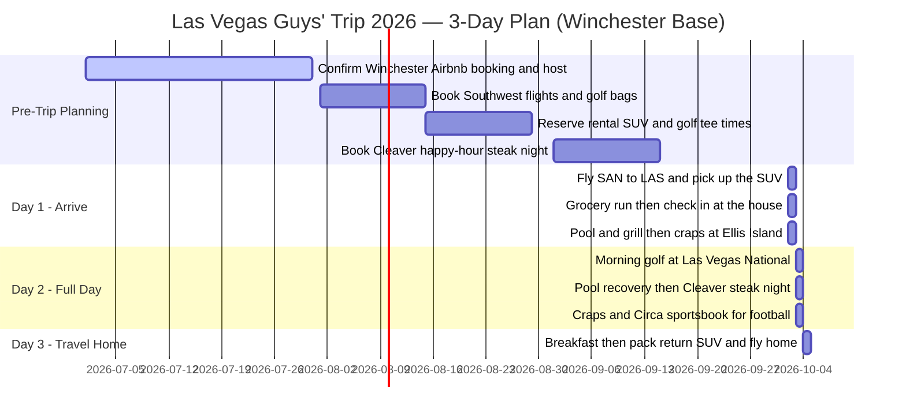

# **Las Vegas Group Trip Strategy (Fall 2026\)**

<button id="theme-toggle" style="position: fixed; top: 20px; right: 20px; z-index: 9999; padding: 10px 16px; cursor: pointer; border-radius: 8px; border: 1px solid #888; font-family: sans-serif; background: #fff; color: #000; font-weight: bold; box-shadow: 0 4px 12px rgba(0,0,0,0.15);">
  🌓 Toggle Theme
</button>

> ## ✅ **Trip Update — Read This First (The Plan Has Changed)**
>
> The original report was built around a Strip-hotel strategy. Based on the latest decisions, the plan has shifted — and the sections below have been **revised to match.**
>
> * **Lodging:** Private **Airbnb house in Winchester** (unincorporated Clark County, just east of the Strip) with a **private pool** — *this replaces the Strip-hotel plan*
> * **The crew:** **5–6 guys**, late 30s / early 40s, all married dads — but this is a *guys'* trip
> * **Length:** **3 days**, with **Day 3 reserved as the travel day** home
> * **Getting there:** **Fly** San Diego (SAN) → Las Vegas (LAS), then a **rented SUV**
> * **Home base:** Winchester sits **5–10 minutes from the Strip**, right next to **Ellis Island** ($5 craps + the $9.99 steak) and Strip nightlife
>
> **The trade-off in one line:** you get a real house with a pool and a full kitchen, you're a short hop from the Strip and Ellis Island's cheap craps, and the things to plan are a rental car (or steady rideshares), a grocery run when you land, and a quick check that the rental is a legitimate Clark County listing. Everything below is built around that.

## **Table of Contents**

* [Part I: Standalone Executive Summary & Action Checklist](#part-i-standalone-executive-summary--action-checklist)
    * [Lodging & Transit](#lodging--transit)
    * [Dining Strategy](#dining-strategy)
    * [Gaming](#gaming)
    * [Active Leisure & Sports Watching](#active-leisure--sports-watching)
    * [Nightlife at the House](#nightlife-at-the-house)
    * [Food and Provisioning](#food-and-provisioning)
* [Part II: In-Depth Feasibility and Economic Optimization Report](#part-ii-in-depth-feasibility-and-economic-optimization-report)
    * [Lodging: The Winchester Airbnb Strategy](#lodging-the-winchester-airbnb-strategy)
    * [San Diego to Las Vegas: Flying and Ground Logistics](#san-diego-to-las-vegas-flying-and-ground-logistics)
    * [Recreational Craps and Table Games Economics](#recreational-craps-and-table-games-economics)
    * [Gastronomy Strategy: Speakeasies, Shared Dining, and Steak Deals](#gastronomy-strategy-speakeasies-shared-dining-and-steak-deals)
    * [Active Leisure, Sports Viewing, and Event Coordination](#active-leisure-sports-viewing-and-event-coordination)
    * [Provisioning the House: Groceries, Grill, and Drinks](#provisioning-the-house-groceries-grill-and-drinks)
    * [Nights In at the House: Pool, Poker, and Movies](#nights-in-at-the-house-pool-poker-and-movies)
    * [Group Travel Optimization and Feasibility Conclusions](#group-travel-optimization-and-feasibility-conclusions)
* [Planning Chart](#planning-chart)
* [Works Cited](#works-cited)

## **Part I: Standalone Executive Summary & Action Checklist**

This high-level, action-oriented checklist outlines exactly what your group should do to get the best bang for your buck on your Las Vegas trip.

### **Lodging & Transit**

* **Lodging:** You're set on a **private Airbnb house with a pool in Winchester** — the unincorporated Clark County pocket just *east* of the Strip, a great spot for a 5–6 person guys' trip. Winchester is the most tightly regulated STR jurisdiction in the valley, but a **December 2025 federal injunction has paused Clark County's enforcement**, so the main move is to **vet the host and confirm the booking is firm** (and re-check the legal status ~30 days out) rather than hunt for a license number. A house gives you a kitchen, a pool, and a living room to gamble and watch football in — far more space per dollar than a Strip suite, and you're minutes from everything.
* **Transit:** **Fly SAN → LAS** (about 1h25 nonstop) and **grab a rental SUV or minivan at the airport.** Winchester is only 5–10 minutes from the Strip, so rideshares are cheap — but one shared vehicle is still the smart play for golf, groceries, and staying together. Fly **Southwest** if you're bringing clubs (its two free checked bags cover a golf travel bag); otherwise rent clubs at the course. Build in one **grocery run** (Sprouts or a Smith's, minutes from the house) on the way in.

### **Dining Strategy**

* **Steak Dinners:** Secure group reservations at **Cleaver** (the spacious sister venue to Herbs & Rye) during their happy hour (Monday–Saturday, 5:00 PM–8:00 PM or late-night 11:59 PM–3:00 AM). This scores you premium, hand-cut steaks at half price (e.g., a 12 oz New York Strip for $29 or a 9 oz Filet Mignon for $35).
* **Ultra-Budget Meals:** Eat at **Ellis Island’s Village Pub & Cafe**. Sign up for their free player's club card to get their legendary $9.99 24/7 top sirloin steak special or ask for their off-menu $15 steak and eggs breakfast.
* **Family-Style Dining:** Head to **Carmine's** in the Forum Shops at Caesars Palace. They serve massive, multi-portion Southern Italian platters meant to be split easily among a group of guys.

### **Gaming**

* **Closest to the house:** **Ellis Island** is the jackpot here — a few minutes from Winchester on Koval Lane, with $5–$10 craps, generous 10x odds, and the legendary $9.99 steak. You're also a short hop to the **Virgin Hotels** casino and the **Westgate SuperBook**, plus the entire Strip is 5–10 minutes away.
* **Value plays worth the drive:** **Ellis Island** (near the Strip on Koval — $5–$10, 10x odds), the **Rio's** $3 daytime craps (3:00 AM–3:00 PM), and **South Point** (~15 min; $10 craps, plus bowling and a movie theater) all stretch the bankroll.
* **Downtown:** **Circa** for the three-story sportsbook (huge on football Sundays), plus **Main Street Station** (20x odds, weekends) and **Downtown Grand** ($5 craps) nearby.
* **Avoid:** the Strip's $15–$25 minimums with stingy odds — unless you specifically want the big-room scene for an hour.

### **Active Leisure & Sports Watching**

* **Golf (close to Winchester):** Play a real round at **Las Vegas National** (~10 min; a classic that hosted tour events and was a filming location for *Casino*, ~$45–$145), **Desert Pines** (Dye-designed and pine-lined), or splurge at **Bali Hai** right on the south Strip. Fall is peak season — **book tee times early** and expect higher rates than summer.
* **Golf entertainment:** For a low-stakes night, grab a bay at **Atomic Golf** (North Strip) or **Topgolf** (MGM Grand). Atomic's all-inclusive packages ($49 Happy Hour / $89 Gold) bundle unlimited food and drinks.
* **Guys' adrenaline:** **Battlefield Vegas** (400+ full-auto machine guns, free Humvee pickup) is a block off the Strip and minutes from the house; gearheads can drive **exotics or off-road trucks** at the Las Vegas Motor Speedway, or make the ~25-min run to **Lake Las Vegas** for boat/jet-ski rentals and a lakeside lunch.
* **Sportsbook viewing:** It's football season — watch Saturday college ball and Sunday NFL at the **Westgate SuperBook** (the world's most famous book, minutes from the house) or **Circa's** 78-million-pixel palace downtown. Reserve seats early for any Raiders home game.

### **Nightlife at the House**

* **Pool + grill nights:** The pool is your built-in nightclub. Plan at least one **grill-out by the pool** (ribeyes/burgers/brats), bring a **Bluetooth speaker**, and keep a cooler of beer/seltzer stocked.
* **Home poker + craps:** Bring a **500-chip poker set, two decks, and a blinds-timer app** for a house tournament, plus a cheap **craps felt + casino dice** for an after-hours table. This is the cheapest, most fun gambling of the trip.
* **Movie night:** Don't haul DVDs — bring a **streaming login + a small portable projector** for a poolside screening (or just use the house smart TV). A guys'-trip movie list is in the Nights-In section below.

### **Food and Provisioning**

* **Land and stock up:** Hit **Sprouts on E. Tropicana** or a **Smith's / Albertsons on Maryland Parkway** — both minutes from the house (the nearest Costco is a ~20-min drive, so skip it unless you want bulk). Buy breakfast, grill meat, snacks, and *a lot* of water, Gatorade, and beer.
* **Eat-in / eat-out balance:** Cook **breakfast and a couple of grill dinners at the house**, and save the budget for **one big steak night out** (Cleaver happy hour) plus casino comps.
* **Hangover kit:** electrolytes (Liquid IV/Gatorade), ibuprofen, antacids, and cases of water. Future-you will be grateful.

## **Part II: In-Depth Feasibility and Economic Optimization Report**

### **Lodging: The Winchester Airbnb Strategy**

You've booked a private Airbnb house with a pool in **Winchester** — the unincorporated Clark County neighborhood immediately *east* of the Strip (think Paradise Road and Maryland Parkway, right by Ellis Island, the Virgin Hotels, and the Las Vegas Country Club). For this trip the location is excellent: you're 5–10 minutes from the Strip and steps from the cheapest craps in town. The one thing worth understanding is the legal backdrop, because Winchester sits in the *most* tightly regulated short-term-rental (STR) jurisdiction in the valley — and that situation is, as of 2026, in flux in a way that actually works in your favor right now.

Within unincorporated Clark County, which encompasses the entire tourist corridor and the Las Vegas Strip, short-term rentals were historically banned and are now subject to highly restrictive licensing caps. Under local ordinances implementing state assembly bill AB363, short-term rental licenses are strictly capped at 1% of the total housing supply, limiting the legal inventory to roughly 2,940 units across the entire county. To prevent clustering, legal properties must be separated by at least 1,000 feet from other licensed short-term rentals and must maintain a strict 2,500-foot buffer zone from any major resort-hotel. Inside the municipal boundaries of the City of Las Vegas, the regulations are even tighter: properties must be owner-occupied throughout the rental duration, limited to three bedrooms, separated by 660 feet from other rentals, and similarly barred within 2,500 feet of a resort-hotel.

| Jurisdictional Zone | Spacing Rule | Resort-Hotel Buffer | License Status (2026) | Verdict for Your Group |
| --- | --- | --- | --- | --- |
| **City of Las Vegas** | 660 ft separation | Minimum 2,500 Feet | Capped + owner-occupied | The hardest jurisdiction |
| **City of Henderson** | 1,000 ft separation | Not the limiting factor | Open registration (~$820/yr) | Easiest; a clean backup if you ever switch |
| **✅ Clark County (Winchester — your zone)** | 1,000 ft separation | Minimum 2,500 Feet | Capped lottery, **currently blocked by a federal injunction** | **Your house; enforcement is paused but the law is unsettled** |

Here's the backdrop. Unincorporated Clark County — which includes Winchester — passed a strict STR ordinance (capped licenses, a 2,500-foot buffer from resorts, and steep fines), and for years near-Strip rentals lived in a legal gray zone. But in **December 2025 a federal judge issued a preliminary injunction that blocks Clark County from enforcing its STR licensing and penalties** while the case is appealed. As of early 2026 the county had approved only a couple hundred permits out of more than 11,000 listings, so in practice most Winchester rentals operate under that injunction rather than a formal license. The upside for you: the risk of code enforcement shutting your booking down right before arrival is **lower right now** than it would have been a year ago. The catch: the law is unsettled — the county is appealing — so treat it as a moving target.

Because you can't lean on a license number the way you could in Henderson, de-risk the booking the old-fashioned way:

* **Vet the host and listing hard:** lots of recent five-star reviews, an established Superhost, and prior guests who clearly stayed *at this house* — not a brand-new listing with no track record.
* **Confirm the essentials in writing:** the reservation is firm for your exact nights, it sleeps 5–6 with enough real beds, the pool is open in early October, and there's parking for your rental SUV.
* **Re-check the legal status ~30 days out.** This is an active court fight; a quick search for "Clark County short-term rental" before the trip will tell you if anything material has changed.
* **Keep a refundable backup ready** (see below) so even a worst-case host cancellation a few days out doesn't blow up the trip.

If your Airbnb ever falls through, the cleanest backups that replicate the shared-house feel with zero regulatory risk are the legal off-Strip suite and villa resorts below — purpose-built for high-capacity group travel.

Marriott’s Grand Chateau, located on East Harmon Avenue, sits a mere half-block off the Strip. The property is designed primarily as a vacation ownership resort, meaning it completely lacks an active casino floor, making the common areas exceptionally clean, quiet, and smoke-free. The premier configuration for a group is the three-bedroom villa, a 1,179-square-foot residence that sleeps up to 12 guests and features a full kitchen, multiple bathrooms, a spacious living area, and an in-unit washer and dryer. Because the property charges zero resort fees and provides free on-site private parking, it represents a highly predictable, high-value option.

While other suite alternatives like the Hilton Grand Vacations Club Elara offer excellent multi-bedroom configurations, floor-to-ceiling windows, and direct connection to the Miracle Mile Shops, our verified audit shows that Elara now charges a daily resort fee of $45 (totaling $51.02 per night with tax), along with standard parking charges. For groups prioritizing proximity to high-end resort complexes like Aria, Cosmopolitan, and Bellagio, Vdara Hotel & Spa offers premium studio and multi-bedroom suites equipped with kitchenettes. While Vdara charges standard luxury resort fees ($50/night or $56.69 with tax), its non-gaming, non-smoking environment and convenient pedestrian bridge connections make it an appealing option for mid-career professionals seeking upscale comfort.

| Property Name | Room Types | Peak Room Capacity | Kitchen Facilities | Daily Resort Fee (2026) | Daily Self-Parking Fee |
| --- | --- | --- | --- | --- | --- |
| **Marriott’s Grand Chateau** | 1 to 3-Bedroom Villas | Up to 12 Guests | Full Kitchen & Laundry | **$0.00 (Waived)** | **$0.00 (Complimentary)** |
| **HGVC Elara** | 1 to 4-Bedroom Suites | Up to 10+ Guests | Full Kitchen | $45.00 ($51.02 with tax) | $20.00 - $25.00 |
| **Vdara Hotel & Spa** | Studios & 1-2 Bed Suites | Up to 6 Guests | Kitchenettes | $50.00 ($56.69 with tax) | $20.00 - $25.00 |

### **San Diego to Las Vegas: Flying and Ground Logistics**

You're flying, which is the right move for a short 3-day trip. The nonstop from San Diego International (SAN) to Harry Reid International (LAS) covers 258 miles in about 1 hour and 28 minutes — versus a 5-hour (often 7–8 hour on a Friday) grind up Interstate 15. With the flight itself a non-issue, the two things actually worth planning are **your bags (golf clubs)** and **how you'll get around** — and because Winchester sits right against the east side of the Strip, getting around is easier here than it would be from the suburbs.

Southwest Airlines is the dominant carrier on this corridor, operating 156 weekly flights, including 11 daily weekday nonstops, 8 on Saturdays, and 12 on Sundays. Southwest offers structural advantages for golf trips, as their standard ticketing allows for two free checked bags (easily accommodating heavy golf travel bags) and features zero change fees. While promotional one-way fares on Southwest can drop as low as $69, standard round-trip pricing during the high-demand late September and early October travel window typically averages between $102 and $279, depending on the booking lead time.

Ultra-low-cost carriers like Frontier Airlines offer lower base one-way fares, starting from $25 to $34. However, low-cost carriers impose strict, high surcharges for carry-on items, seat assignments, and checked baggage, which quickly erase any initial cost savings for travelers carrying equipment. Other legacy carriers such as Alaska Airlines offer direct nonstops starting around $98 one-way, while United and American Airlines primarily operate one-stop connecting routes that start between $92 and $93 but take much longer. To secure the most competitive aviation rates, historical pricing data suggests booking exactly two months prior to departure.

**Rent one vehicle at the airport.** Winchester is close enough to the Strip (5–10 minutes) that you *could* rideshare everything, but a single shared SUV or minivan is still the smart call — it's cheaper than six separate Ubers to golf and the grocery store, and it keeps the crew together. Pick it up at the LAS rental center and you've got mobility for golf, groceries, and casino-hopping. Expect roughly $60–$110/day for an SUV in the fall season, which split 5–6 ways is trivial. (If you'd rather skip the car entirely, the proximity to the Strip makes a rideshare-only trip genuinely viable here — it wouldn't have been from Henderson.)

**Plan for the golf clubs.** If you're bringing your own sticks, fly **Southwest** — its two-free-checked-bags policy covers a golf travel bag at no charge, which no other carrier matches. If you'd rather travel light, every course in this report rents clubs for about $50–$75; just reserve them with your tee time. Either way, **build in one grocery run** on the drive from the airport to the house (see the provisioning section).

**Have a Strip-night plan.** From Winchester it's only a ~$10–$20 rideshare each way to the Strip (a bit more to downtown) — one of the real perks of this location. For nights you're gambling and drinking, either **designate a driver** in the rental or **split Ubers** — don't drive impaired, and don't pay six separate surge fares when one big SUV ride covers the crew.

| Option | Per-Person Cost | Golf Clubs | Speed | Verdict for This Trip |
| --- | --- | --- | --- | --- |
| **✈️ Southwest (your pick)** | $138 – $558 roundtrip | **Two checked bags free** (clubs ride free) | ~1.5 hr nonstop | **Best** — fast, club-friendly, no I-15 traffic |
| **Frontier / ULCC** | $50 – $120 base roundtrip | Pricey bag fees erase the savings | ~1.5 hr nonstop | OK if you pack light and skip clubs |
| **Rental SUV at LAS** | ~$60 – $110/day split 5–6 ways | Full cargo space | n/a | **Recommended** (Winchester is close, but a car helps for golf + groceries) |
| **Driving from San Diego** | $12 – $32 fuel split | Free cargo space | 5–8 hr (I-15 traffic) | Skipped — you're flying |

### **Recreational Craps and Table Games Economics**

For a group of recreational gamblers who enjoy craps, understanding the math behind table game structures is vital for preserving their bankrolls. Craps is unique because it features some of the lowest house-edge bets in the casino alongside some of the highest. The base Pass Line wager carries a minor house edge of 1.41%, while the Don't Pass wager sits at 1.36%.

Once a point is established, the player can back their line bet with "odds". The odds wager carries a mathematical house edge of exactly 0.00%, paying out at true odds. By maximizing their odds bets, players drastically dilute the overall house edge of their total money in play. For example, on a point of 4 or 10, the true mathematical odds payout is 2:1; on a 5 or 9, it is 3:2; and on a 6 or 8, it is 6:5. At a standard 3-4-5x odds table with a $5 minimum line bet, a player can back their bet with $15 on a point of 4/10, $20 on a 5/9, and $25 on a 6/8, with each odds bet winning exactly $30.

On the Las Vegas Strip, traditional craps minimums have inflated significantly, regularly starting at $15 to $25 with restrictive 3x-4x-5x odds limits. This requires a significant bankroll just to survive a standard cold streak. To play live-dealer craps at a more accessible level, players must seek out off-Strip, Downtown, and locals casinos.

Ellis Island, located just one block east of the Strip on Koval Lane, is highly regarded for offering a live felt craps table with a consistent $5 minimum (which shifts to $10 during peak weekend hours) and exceptionally generous 10x odds. In the Downtown market, the Downtown Grand offers $5 live craps daily, while Main Street Station offers the highest-value craps odds in Southern Nevada at 20x maximum odds, although their tables are strictly open from Friday through Sunday.

For players seeking even lower financial exposure, electronic and hybrid craps options are highly viable. Excalibur, New York-New York, and Planet Hollywood offer hybrid Interblock or "Roll to Win" stadium craps. These setups feature a live dealer throwing physical dice on a central table, while players place their bets on individual touchscreen terminals. This keeps table minimums at a flat $5 and speeds up the pace of play, though maximum odds are generally capped at double or 3-4-5x. Additionally, players must check the Field 12 payouts: about half of Las Vegas casinos pay double on a Field 12, while higher-value properties like the Rio, Palms, and South Point pay a more player-favorable triple.

| Casino Property | Location relative to Strip | Craps Table Minimum | Max Odds Limit | Field 12 Payout | Key Tactical Notes |
| --- | --- | --- | --- | --- | --- |
| **Ellis Island** | Near Strip (Koval Lane) | $5 - $10 | 10x Odds | Pays Double | Highly energetic, popular with locals |
| **Rio Hotel & Casino** | Off-Strip (W Flamingo Rd) | $3 (3 AM - 3 PM daily) | 3-4-5x Odds | Pays Triple | Best value for daytime play |
| **Main Street Station** | Downtown (Fremont St) | $15 | 20x Odds | Pays Double | Tables are weekend-only (Fri-Sun) |
| **Downtown Grand** | Downtown (Fremont St) | $5 | 10x Odds | Pays Double | Consistent daily low minimums |
| **Palms Casino Resort** | Off-Strip (W Flamingo Rd) | $15 | 10x Odds | Pays Triple | Excellent mid-tier option off-Strip |
| **Oyo Hotel & Casino** | Near Strip (Tropicana Ave) | $5 - $10 | 3-4-5x Odds | Pays Double | Walkable from MGM Grand |
| **South Point** | Deep South Strip (locals) | $10 | 2x Odds | Pays Triple | Excellent locals gaming value |

#### **Near-the-House Craps (Winchester Is Steps from Ellis Island)**

Because you're based in Winchester, your most convenient action is **Ellis Island** — the off-Strip locals favorite on Koval Lane, just a few minutes from the front door, with low minimums and a generous 10x odds. From there the whole Strip is a 5–10 minute hop, and the famous Westgate SuperBook and the Virgin Hotels casino are right in the neighborhood. The Henderson locals rooms (Green Valley Ranch, M Resort) are still worth a dedicated trip for their value, but they're now a 20–25 minute drive rather than your default.

| Casino | Drive From the House | Typical Craps Minimum | Max Odds | Why Go |
| --- | --- | --- | --- | --- |
| **Ellis Island** | ~5 min (Koval Lane) | $5 – $10 | 10x | The hero pick — cheap, lively craps, plus the $9.99 steak |
| **Virgin Hotels (Mohegan)** | ~5 min (Paradise Rd) | $10 – $15 | 3-4-5x | Stylish off-Strip room; pairs with its pool scene |
| **The Strip (Flamingo / Horseshoe / Paris)** | 5–10 min | $15 – $25 | 3-4-5x | When you want the big-room spectacle for an hour |
| **Palace Station** | ~10 min (Sahara / I-15) | $5 – $10 | 3-4-5x | Renovated locals room, cheap minimums, easy parking |
| **Boulder Station** | ~12 min (Boulder Hwy) | $5 – $10 | 3-4-5x | No-frills cheap action a little to the east |
| **Green Valley Ranch / M Resort** | ~20–25 min (Henderson) | $5 – $10 | 3-4-5x (GVR crapless: 10x) | Worth a dedicated trip for upscale locals value |

*Minimums climb on weekend nights and during big football windows, so go earlier in the evening for the lowest tables — and always back your line bet with full odds. Posted minimums change; confirm at the table.*

### **Gastronomy Strategy: Speakeasies, Shared Dining, and Steak Deals**

Group dining for a party of late-30s and early-40s dads requires a balance of high-quality food, generous portions, a mature atmosphere, and prices that avoid heavy Strip inflation. The premier option satisfying these criteria is the off-Strip speakeasy steakhouse concept, specifically Herbs & Rye and its sister restaurant, Cleaver.

Both venues are owned by the same proprietor, share an executive chef, and feature identical dark-leather, vintage-glamour speakeasy aesthetics. The key to maximizing value at these properties is their highly aggressive steak happy hour. Running from Monday through Saturday between 5:00 PM and 8:00 PM, and late-night from 11:59 PM to 3:00 AM, the happy hour slashes the cost of steaks and select entrees by 40% to 50%.

While Herbs & Rye is highly popular and frequently requires booking weeks in advance, Cleaver is significantly larger, making it much easier to secure tables for large groups. Additionally, Cleaver specializes in premium bone-in cuts of steak, whereas Herbs & Rye focuses on boneless cuts.

*Note on Community Feedback:* While local communities on forums like Reddit highly praise the value of the happy hour, users note that because the discount is baked into the regular operations, it is crucial to tip based on the value of the food and service rather than just the discounted total. For the ultimate group dining value, community members highly recommend getting the Double Cut Bone-In Pork Chop with truffle butter at Cleaver for an incredible $28.

| Steak Cut & Portion Size | Regular Dinner Price | Discounted Happy Hour Price (✪✪) | Notable Culinary Features |
| --- | --- | --- | --- |
| **Flat Iron (8 oz)** | $42 | $24 | Tender, lean cut with direct char grill |
| **New York Strip (12 oz)** | $56 | $29 | Excellent sear, juicy chew, robust smoke flavor |
| **Filet Mignon (9 oz)** | $64 | $35 | Extremely tender, melt-in-your-mouth texture |
| **Ribeye (16 oz)** | $78 | $46 | Highly marbled, rich, flavorful classic cut |
| **Bone-In Pork Chop (12 oz)** | $41 | $22 | Extremely juicy, excellent alternative to beef |
| **Double Cut Pork (16 oz)** | $53 | $28 | Topped with truffle butter and raw horseradish |
| **Spicy Mussels (Appetizer)** | $40 | $22 | Steamed in tomato stew, white wine, chili flakes |
| **Cacio e Pepe (Pasta)** | $28 | $16 | Housemade bucatini, Pecorino, black pepper |

Beyond these two primary locations, groups seeking an iconic, old-school Las Vegas steakhouse experience can book Golden Steer, located off the Strip on Sahara Avenue. Operating since 1958, this legendary venue features the actual leather booths where Frank Sinatra, Dean Martin, and Elvis Presley once dined. While considerably more expensive—with appetizers starting around $26 to $28 and prime steaks priced at standard fine-dining rates—Golden Steer provides impeccable tableside presentations, delivering high-end nostalgic value.

For groups seeking top-tier steaks in a more modern environment, Echo & Rig (located off-Strip in Summerlin) and Silverado Steakhouse (located inside South Point) offer excellent dining value at lower prices than Strip resorts.

For casual, ultra-budget group dining, Ellis Island’s Village Pub & Cafe offers one of the best value propositions in Las Vegas: the $9.99 Steak Special. Available 24/7 to any guest signed up for the casino's free Player’s Club, the special features a 10-ounce top sirloin steak served with three side dishes.

Additionally, Ellis Island features an award-winning BBQ joint serving slow-cooked ribs and chicken, as well as an off-menu $15 steak and eggs breakfast special in the Village Pub. On the Strip, groups can secure family-style dining at Carmine’s in the Forum Shops at Caesars Palace. Carmine’s specializes in massive, multi-portion Southern Italian platters designed to be shared among four to six diners, bringing the per-capita cost down to a very reasonable $30 to $40.

### **Active Leisure, Sports Viewing, and Event Coordination**

A well-balanced itinerary for a group of mid-career dads should include engaging group activities that offer competitive fun at a controlled cost. High-tech golf entertainment centers are perfect for this demographic, and Las Vegas features two competing concepts: the globally recognized Topgolf (located at MGM Grand) and the newer, high-tech Atomic Golf (located next to the Strat on the North Strip).

Topgolf operates on traditional hourly bay rentals, ranging from $42 to $99 per hour for up to six players. However, because food and beverages are strictly à la carte, group tabs can escalate rapidly.

Atomic Golf operates a massive four-level venue with 103 high-tech hitting bays, six distinct bars, and a high-energy nightclub atmosphere. Critically, Atomic Golf offers highly cost-effective all-inclusive group packages: the $49 Happy Hour package and the $89 Gold package cover a reserved bay for two hours and include unlimited food and unlimited beer, seltzers, wine, and cocktails. This flat-rate pricing provides exceptional value for a group of dads.

| Feature Category | Atomic Golf (Strat Area) | Topgolf (MGM Grand) |
| --- | --- | --- |
| **Gameplay Style** | Tech-enhanced, themed games with immersive visuals | Traditional point-scoring golf games |
| **Atmosphere** | High-energy, nightclub vibes, dynamic lighting | Casual, sports bar, family-friendly |
| **Hourly Bay Rates** | $40 - $100 per bay | $42 - $99 per bay |
| **All-Inclusive Deals** | **$49 Happy Hour / $89 Gold** (Unlimited food & drinks) | **None** (Strictly à la carte menu pricing) |
| **Locals Discount** | 25% Off General Bay Bookings | $50/hour Sunday Flat Rate |

For groups wanting to play a real round of golf, Southern Nevada offers several public budget-friendly courses. Aliante Golf Club in North Las Vegas features a challenging routing with unique water hazards and is priced at a reasonable $99 to $129 for non-residents. Boulder City Golf Course, located about 30 minutes from the Strip, is an older, relaxed municipal course lined with mature trees, offering low-stress play at a budget rate. The Las Vegas Golf Club is the oldest municipal course in the valley (dating back to 1938), offering wide, forgiving fairways and low rates. And just east of the Strip, the historic Las Vegas National is another highly accessible, budget-friendly venue.

For a quick, casual game, the North Las Vegas Municipal Par 3 Golf Course offers 9 holes for just $10 to $12 per round, with club and pull-cart rentals available for $10. These courses stand in stark contrast to premium public venues like Cascata or Wynn Golf Club, which require room stays and charge green fees from $500 to over $1,250.

Because your house is in Winchester, you've got several good courses within about 10–15 minutes — no cross-town drive required. **Las Vegas National** is the standout value and a slice of history: a classic 1960s course that has hosted PGA and LPGA events, appeared in the movie *Casino*, and still runs roughly $45–$145. **Desert Pines** is the "Pinehurst of Las Vegas," a Dye-designed, pine-lined track a few minutes away, and its sister course **Royal Links** (replica holes from British Open venues) is a fun bucket-list round. For a true splurge, **Bali Hai** sits right at the south end of the Strip with its island green and tropical landscaping. (The premium Henderson and Summerlin courses — Reflection Bay, Rio Secco, TPC Las Vegas — are ~20–30 minutes out if you want a destination round.) One important note: **fall is peak golf season in Las Vegas**, so rates run higher than the summer numbers and prime weekend tee times sell out — book as soon as your dates are locked.

| Course | Drive From the House | Ballpark Fall Green Fee | Notes |
| --- | --- | --- | --- |
| **Las Vegas National** | ~10 min | ~$45 – $145 | Best value + history; a filming location for *Casino* |
| **Desert Pines** | ~10 min | ~$100 – $200 | Dye design, pine-lined, "Pinehurst of Vegas" |
| **Royal Links** | ~12 min | ~$120 – $230 | Replica holes from British Open venues; fun group round |
| **Bali Hai** | 5–10 min (south Strip) | ~$150 – $300 | On-Strip splurge, island green, tropical landscaping |
| **Reflection Bay / Rio Secco** | ~20–30 min (Henderson) | ~$150 – $250 | Premium destination rounds if you want the drive |

Golf isn't the only group adrenaline option. **Battlefield Vegas** stocks 400+ full-auto machine guns and will send a Humvee to pick you up — and it's a block off the Strip, minutes from your Winchester house, making it an easy guys'-trip morning. Gearheads can drive real exotics or off-road trucks at the **Las Vegas Motor Speedway**, and if you want a half-day excursion, **Lake Las Vegas** (~25 minutes east) has boat and jet-ski rentals plus a lakeside lunch. Any of these pairs perfectly with an afternoon back at the pool.

For watching and betting on sports, Circa Resort & Casino in Downtown Las Vegas is the undisputed premier destination. Circa's sports book features a massive, three-story, 78-million-pixel high-definition screen, stadium-style seating for 1,000 guests, and low minimum bets of $5 to $10, making it accessible to recreational players.

Alternatively, off-Strip locals properties like Palace Station have fully renovated sports books featuring giant LED viewing walls, comfortable VIP seating, and significantly lower food and beverage costs than the major Strip casinos.

#### **Fall 2026 Sports, Concerts, and Convention Calendars**

Timing is critical when planning a fall 2026 trip. The late September and early October window is highly dynamic, featuring massive sports matchups, major music festivals, and large trade conventions that drive room rates and table minimums up across the entire Las Vegas valley.

| Key Dates (2026) | Event or Convention Name | Host Venue Location | Expected Attendance / Impact | Strategic Implications for Group |
| --- | --- | --- | --- | --- |
| **Sept 13, 2026** | **Raiders vs. Miami Dolphins** | Allegiant Stadium | ~65,000 Fans | NFL Home Opener; sportsbooks and transit will be congested |
| **Sept 23 – 25, 2026** | **PRINTING United Expo 2026** | Las Vegas Convention Center | ~30,000 Attendees | Drives up midweek room rates on the North Strip |
| **Sept 28 – Oct 1, 2026** | **Global Gaming Expo (G2E)** | Venetian Expo | ~29,000 Attendees | Midweek room rates spike at center-Strip properties |
| **Thursday, Oct 1, 2026** | **Metallica Sphere Residency** | The Sphere | ~18,000 Fans | High-demand "no-repeat" weekend show; book tickets far in advance |
| **Oct 3 – Oct 5, 2026** | **Reggae Rise Up Festival** | Las Vegas Events Center | High public attendance | Outdoor music festival; downtown Fremont area will be highly active |
| **Sunday, Oct 4, 2026** | **Raiders vs. Kansas City Chiefs** | Allegiant Stadium | ~65,000 Fans | Divisional rivalry game; sportsbooks will fill up by 9:00 AM |
| **Oct 6 – Oct 9, 2026** | **NACS Annual Exposition** | Las Vegas Convention Center | ~26,000 Attendees | Major midweek convention; premium pricing on North Strip lodging |
| **Oct 10 – Oct 12, 2026** | **Best Friends Forever Festival** | Las Vegas Events Center | High public attendance | Emo and indie rock focus; appeals directly to the late 30s/early 40s age bracket |

### **Provisioning the House: Groceries, Grill, and Drinks**

Since you're flying, you'll land empty-handed — so the single most important logistical move of the trip is **one big grocery run on the way from the airport to the house.** Winchester doesn't have a Costco close by (the nearest is ~20 minutes out), but it's loaded with regular supermarkets minutes from the door: **Sprouts Farmers Market on East Tropicana**, plus **Smith's and Albertsons on Maryland Parkway**. One stop for 5–6 guys takes about 30 minutes and covers roughly 80% of the trip's food and drink at a fraction of Strip or convenience-store prices. (If you've got a Costco membership and don't mind a short drive for bulk beer and steaks, the St. Rose Parkway warehouse is the closest.)

Buy for the meals you'll actually cook at the house — a full breakfast every morning and a couple of poolside grill dinners — and lean on restaurants only for the one or two marquee nights out. Here's a battle-tested shopping list for a 3-day guys' trip:

| Category | What to Grab | Why |
| --- | --- | --- |
| **Breakfast** | Eggs, bacon/sausage, bagels or English muffins, butter, coffee + filters/pods, creamer, OJ, fruit, frozen breakfast burritos | A hot breakfast at the house beats $25 Strip eggs and soaks up the night before |
| **Grill (dinners)** | Ribeyes or NY strips for a steak night, burgers + buns, brats/hot dogs, chicken thighs, corn, foil, charcoal/propane if needed | Your pool is a built-in steakhouse; one great grill night rivals a restaurant for a tenth the cost |
| **Lunch / easy** | Deli meat + cheese + bread, frozen wings or pizzas, tortilla chips + salsa/guac, a rotisserie chicken | Fast fuel between golf and gambling, no reservation required |
| **Snacks** | Beef jerky, mixed nuts, trail mix, pretzels, candy, protein bars | Everyone grazes more on vacation — overbuy slightly |
| **Drinks** | Beer + seltzer (a lot), cases of bottled water, Gatorade/Liquid IV, mixers + a couple bottles of liquor, soda, **bags of ice** | Water and electrolytes are non-negotiable in the desert; ice always runs out first |
| **Supplies + hangover kit** | Paper plates/cups, napkins, paper towels, trash bags, red Solo cups, sunscreen, ibuprofen, antacids, electrolyte packets | The stuff nobody remembers until 11 PM or 7 AM |

A few pro moves: confirm with your host whether the house has a **working grill and basic cookware** (most do, but bring a cheap **meat thermometer** and a lighter just in case); assign **one person as "kitchen GM"** so you don't end up with five guys buying chips and nobody buying eggs; and **overbuy water and ibuprofen** — the desert and the late nights guarantee you'll use them.

### **Nights In at the House: Pool, Poker, and Movies**

Half the point of renting a house instead of hotel rooms is the **nights in** — the unstructured, no-cover, no-bottle-service hangs that are honestly the best part of a married-dads guys' trip. Your house has the one amenity that matters most for this: **a private pool.** Build your evenings around it.

**The pool is your clubhouse.** Plan at least one full night where nobody leaves: fire up the grill, set a **Bluetooth speaker** out (bring one — don't trust the house to have audio), float around with a beer, and let the night run long. A few cheap floats and a string of **battery LED lights** turn a backyard pool into the best lounge you'll visit all weekend. (Quick etiquette note: most Vegas STRs are strictly **non-smoking indoors** and have **quiet hours** — and since Winchester is a residential neighborhood in an enforcement-sensitive county, this matters more than usual. Keep cigars and the speaker outside and dial it back after ~10 PM; a neighbor noise complaint is exactly the kind of thing you don't want drawing attention to the rental, and it can cost you the deposit.)

**Run a home poker tournament.** This is the cheapest, most fun gambling you'll do all trip and the best way to needle your buddies. Bring (it all packs flat in a checked bag):

* A **300–500 chip poker set** and **two decks of cards**
* A **blinds-timer app** on someone's phone and an agreed buy-in (e.g., $40 with one rebuy)
* Optional but great: a cheap **roll-up craps felt + a pair of casino dice** so you can run a friendly home craps game and practice your bets before you hit Ellis Island for real

**Movie night — don't bring DVDs.** Physical media is dead and you won't know what the house TV supports. Instead:

* Bring a **streaming login** (Netflix / Max / Prime / ESPN+) and a small **Fire Stick or Apple TV** plus an **HDMI cable** so you control the screen regardless of the house setup
* For a memorable poolside screening, a **$100–$150 portable projector** pointed at the garage door or a hung sheet turns the backyard into an outdoor theater
* **Download a couple of movies** to a laptop as an offline backup (handy on the flight, too)

A ready-made **guys'-trip watch list**, heavy on the Vegas and poker canon:

| Vibe | Picks |
| --- | --- |
| **Vegas classics** | *Ocean's Eleven*, *The Hangover*, *Casino*, *Swingers* |
| **Poker / gambling** | *Rounders*, *Maverick*, *Molly's Game* |
| **Dumb-funny comfort** | *Old School*, *Step Brothers*, *Tommy Boy*, *Wedding Crashers* |
| **Golf** | *Caddyshack*, *Happy Gilmore* |
| **Big-screen action** | *Top Gun: Maverick*, *John Wick*, *Heat*, the *Dune* films |

And don't overlook the obvious: it's **football season.** A fall weekend means a full slate of **Saturday college football and Sunday NFL** — the house TV plus your phones (and the casino sportsbooks for the games you've got money on) mean you can have RedZone going by the pool all afternoon. Honestly, a lazy Sunday of football, the grill, and the pool may end up being everyone's favorite block of the trip.

### **Group Travel Optimization and Feasibility Conclusions**

To execute a high-value, low-friction trip for 5–6 married dads flying in from San Diego for three days, the plan comes down to a handful of structured decisions — most of which key off the Winchester house.

First, lock in the lodging. Your Winchester Airbnb is well-placed — east of the Strip and minutes from Ellis Island — but it sits in Clark County, the valley's strictest STR jurisdiction. The saving grace is a 2025 federal injunction that has paused county enforcement, so rather than chase a license number, **vet the host and confirm the booking is firm**, re-check the legal status about a month out, and keep a refundable backup (like a Marriott's Grand Chateau suite) in your back pocket. The house — with its kitchen, living room, and especially the pool — is the hub the whole trip orbits.

Second, fly Southwest and rent one SUV. The nonstop is 90 minutes, two free checked bags carry your clubs, and a single full-size rental keeps the crew together and mobile (though Winchester is close enough to the Strip that a rideshare-only trip is a real option). Build in a **grocery run between the airport and the house** so the kitchen and coolers are stocked before night one.

Third, keep the gambling close and cheap. Your nightly craps is five minutes away at **Ellis Island** — $5–$10 minimums, 10x odds, and a $9.99 steak — with the entire Strip a short hop beyond it. The Henderson locals rooms (Green Valley Ranch, M Resort) are still great value if you want a dedicated trip, but you no longer have to drive across the valley to find a cheap table.

Fourth, golf close to home. Book a morning at **Las Vegas National or Desert Pines** (reserve early — fall is peak season), and mix in a guys'-trip wildcard like Battlefield Vegas just off the Strip. Spend on **one marquee steak night out at Cleaver's happy hour** (a 12oz New York Strip for $29), and cook the other nights on the grill by the pool.

Finally, protect the nights in. The pool, a home poker tournament, a poolside movie, and a full slate of fall football are the cheapest — and often the best — entertainment of the trip. Treat **Day 3 as a genuine travel day**: a relaxed breakfast, pack up, return the rental, and fly home. Built this way, the trip delivers a great guys’ weekend without the Strip’s markups.

#### **Planning Chart**

#### **Works cited**

1. Rooms & Suites \| Marriott's Grand Chateau, accessed May 23, 2026, [https://www.marriott.com/en-us/hotels/lasvg-marriotts-grand-chateau/rooms/](https://www.google.com/search?q=https://www.marriott.com/en-us/hotels/lasvg-marriotts-grand-chateau/rooms/)
2. Marriott's Grand Chateau® \| The Marriott Vacation Clubs, accessed May 23, 2026, [https://www.marriottvacationclubs.com/experiences/resorts/marriotts-grand-chateau.html](https://www.google.com/search?q=https://www.marriottvacationclubs.com/experiences/resorts/marriotts-grand-chateau.html)
3. Marriott's Grand Chateau \| Vacation Ownership Hotel near Las Vegas Strip, accessed May 23, 2026, [https://www.marriott.com/en-us/hotels/lasvg-marriotts-grand-chateau/overview/](https://www.google.com/search?q=https://www.marriott.com/en-us/hotels/lasvg-marriotts-grand-chateau/overview/)
4. Suites at Marriott's Grand Chateau Las Vegas Strip-No Resort Fee, accessed May 23, 2026, [https://www.booking.com/hotel/us/suites-at-marriott-39-s-grand-chateau-las-vegas.html](https://www.google.com/search?q=https://www.booking.com/hotel/us/suites-at-marriott-39-s-grand-chateau-las-vegas.html)
5. Las Vegas Strip Restaurants \| Eat at Ellis Island Hotel, Casino & Brewery, accessed May 23, 2026, [https://www.ellisislandcasino.com/eat](https://www.google.com/search?q=https://www.ellisislandcasino.com/eat)
6. Las Vegas Raiders announce 2026 schedule, accessed May 23, 2026, [https://www.raiders.com/news/las-vegas-raiders-2026-schedule-release-nfl-regular-season-allegiant-stadium](https://www.google.com/search?q=https://www.raiders.com/news/las-vegas-raiders-2026-schedule-release-nfl-regular-season-allegiant-stadium)
7. Las Vegas Raiders Schedule \| Allegiant Stadium, accessed May 23, 2026, [https://www.visitlasvegas.com/experience/post/the-raiders-schedule-release-is-here/](https://www.google.com/search?q=https://www.visitlasvegas.com/experience/post/the-raiders-schedule-release-is-here/)
8. Raiders 2026 Schedule \| Las Vegas Raiders, accessed May 23, 2026, [https://www.raiders.com/schedule/](https://www.google.com/search?q=https://www.raiders.com/schedule/)
9. 2026 Las Vegas Raiders Schedule - FBSchedules.com, accessed May 23, 2026, [https://fbschedules.com/2026-las-vegas-raiders-schedule/](https://www.google.com/search?q=https://fbschedules.com/2026-las-vegas-raiders-schedule/)
10. Is Nevada short-term rental law an Airbnb 'ban in disguise' in Vegas? Critics say so., accessed May 23, 2026, [https://thenevadaindependent.com/article/nevada-passed-a-short-term-rental-law-four-years-ago-was-it-a-ban-in-disguise](https://www.google.com/search?q=https://thenevadaindependent.com/article/nevada-passed-a-short-term-rental-law-four-years-ago-was-it-a-ban-in-disguise)
11. Short-Term Rentals in Las Vegas: Everything You Need to Know - Hostaway, accessed May 23, 2026, [https://www.hostaway.com/blog/short-term-rentals-in-las-vegas/](https://www.google.com/search?q=https://www.hostaway.com/blog/short-term-rentals-in-las-vegas/)
12. Las Vegas Short Term Rental Regulations 2026 for Investors, accessed May 23, 2026, [https://www.guestable.com/blog/las-vegas-short-term-rental-regulations/](https://www.google.com/search?q=https://www.guestable.com/blog/las-vegas-short-term-rental-regulations/)
13. Making the case for short-term rentals in Las Vegas - Travel Weekly, accessed May 23, 2026, [https://www.travelweekly.com/North-America-Travel/Insights/The-battle-over-short-term-rentals-in-Las-Vegas](https://www.google.com/search?q=https://www.travelweekly.com/North-America-Travel/Insights/The-battle-over-short-term-rentals-in-Las-Vegas)
14. accessed May 23, 2026, [https://mdbrealty.com/blog/navigating-las-vegas-airbnb-regulations-what-hosts-need-to-know](https://www.google.com/search?q=https://mdbrealty.com/blog/navigating-las-vegas-airbnb-regulations-what-hosts-need-to-know)
15. Navigating Las Vegas Airbnb Regulations: What Hosts Need to Know \| Blog \| MDB Realty, accessed May 23, 2026, [https://mdbrealty.com/blog/navigating-las-vegas-airbnb-regulations-what-hosts-need-to-know](https://www.google.com/search?q=https://mdbrealty.com/blog/navigating-las-vegas-airbnb-regulations-what-hosts-need-to-know)
16. Marriott's Grand Chateau, A Marriott Vacation Club Resort [Review] - Upgraded Points, accessed May 23, 2026, [https://upgradedpoints.com/travel/hotels/marriotts-grand-chateau-las-vegas-review/](https://www.google.com/search?q=https://upgradedpoints.com/travel/hotels/marriotts-grand-chateau-las-vegas-review/)
17. Which hotel in Las Vegas? I've got Titanium and am planning 3 nights midweek. Have a choice of the Cosmopolitan, The Westin, or the Las Vegas Marriott. - Reddit, accessed May 23, 2026, [https://www.reddit.com/r/marriott/comments/114ajz0/which_hotel_in_las_vegas_ive_got_titanium_and_am/](https://www.google.com/search?q=https://www.reddit.com/r/marriott/comments/114ajz0/which_hotel_in_las_vegas_ive_got_titanium_and_am/)
18. Southwest® flights from San Diego to Las Vegas from $69, accessed May 23, 2026, [https://www.southwest.com/en/flights/flights-from-san-diego-to-las-vegas](https://www.google.com/search?q=https://www.southwest.com/en/flights/flights-from-san-diego-to-las-vegas)
19. $33 Cheap Flights from San Diego (SAN) to Las Vegas (LAS) - Expedia, accessed May 23, 2026, [https://www.expedia.com/lp/flights/san/las/san-diego-to-las-vegas](https://www.google.com/search?q=https://www.expedia.com/lp/flights/san/las/san-diego-to-las-vegas)
20. $25 Flights from San Diego (SANA) to Las Vegas (LASA) - Skyscanner, accessed May 23, 2026, [https://www.skyscanner.com/routes/sana/lasa/san-diego-to-las-vegas.html](https://www.google.com/search?q=https://www.skyscanner.com/routes/sana/lasa/san-diego-to-las-vegas.html)
21. Las Vegas Craps Minimum Bet and Odds 2026, accessed May 23, 2026, [https://vegasadvantage.com/las-vegas-table-game-survey/craps/](https://www.google.com/search?q=https://vegasadvantage.com/las-vegas-table-game-survey/craps/)
22. Where to Play Cheap $5 Las Vegas Craps and Roulette in 2026, accessed May 23, 2026, [https://vegasadvantage.com/where-to-play-5-craps-and-roulette-in-las-vegas/](https://www.google.com/search?q=https://vegasadvantage.com/where-to-play-5-craps-and-roulette-in-las-vegas/)
23. Are the steaks at Herbs and Rye always discounted? : r/vegas - Reddit, accessed May 23, 2026, [https://www.reddit.com/r/vegas/comments/1n07smh/are_the_steaks_at_herbs_and_rye_always_discounted/](https://www.google.com/search?q=https://www.reddit.com/r/vegas/comments/1n07smh/are_the_steaks_at_herbs_and_rye_always_discounted/)
24. Las Vegas - The Golden Steer, accessed May 23, 2026, [https://goldensteer.com/pages/las-vegas](https://www.google.com/search?q=https://goldensteer.com/pages/las-vegas)
25. Atomic Golf Las Vegas vs Topgolf - Menu, Hours, Prices & Reviews, accessed May 23, 2026, [https://atomicgolf.com/blogs/vegas-golf/atomic-golf-vs-topgolf-the-las-vegas-golf-experience](https://www.google.com/search?q=https://atomicgolf.com/blogs/vegas-golf/atomic-golf-vs-topgolf-the-las-vegas-golf-experience)
26. Topgolf - MGM Grand, accessed May 23, 2026, [https://mgmgrand.mgmresorts.com/en/amenities/topgolf.html](https://www.google.com/search?q=https://mgmgrand.mgmresorts.com/en/amenities/topgolf.html)
27. Menu - Herbs and Rye, accessed May 23, 2026, [https://www.herbsandrye.com/menu](https://www.google.com/search?q=https://www.herbsandrye.com/menu)
28. Las Vegas Sportsbook \| Race & Sports Betting \| Red Rock Resort - Station Casinos, accessed May 23, 2026, [https://stationcasinos.com/play/race-and-sports/](https://www.google.com/search?q=https://stationcasinos.com/play/race-and-sports/)
29. Race and Sports Book - Find Out Why Locals Love Palace Station, accessed May 23, 2026, [https://palacestation.com/play/race-and-sports/](https://www.google.com/search?q=https://palacestation.com/play/race-and-sports/)
30. Thinking of trying Ellis Island for Craps : r/vegas - Reddit, accessed May 23, 2026, [https://www.reddit.com/r/vegas/comments/1hhiv0z/thinking_of_trying_ellis_island_for_craps/](https://www.google.com/search?q=https://www.reddit.com/r/vegas/comments/1hhiv0z/thinking_of_trying_ellis_island_for_craps/)
31. Play, Party & Experience Vegas Like Never Before - Atomic Golf, accessed May 23, 2026, [https://atomicgolf.com/blogs/vegas-nightlife/experience-atomic-golf-play-hard-party-harder](https://www.google.com/search?q=https://atomicgolf.com/blogs/vegas-nightlife/experience-atomic-golf-play-hard-party-harder)
32. Las Vegas Trade Show Calendar 2026 \| Conventions & Events, accessed May 23, 2026, [https://stepandrepeatlasvegas.com/las-vegas-trade-show-calendar/](https://www.google.com/search?q=https://stepandrepeatlasvegas.com/las-vegas-trade-show-calendar/)
33. Top 10 Upcoming Exhibitions in Las Vegas, USA 2026, accessed May 23, 2026, [https://whimsicalexhibits.com/upcoming-exhibitions-in-las-vegas-usa/](https://www.google.com/search?q=https://whimsicalexhibits.com/upcoming-exhibitions-in-las-vegas-usa/)
34. Las Vegas Conventions (2026), accessed May 23, 2026, [https://www.lasvegasdirect.com/las-vegas-conventions/](https://www.google.com/search?q=https://www.lasvegasdirect.com/las-vegas-conventions/)
35. Top 50 Upcoming Trade Shows in Las Vegas (2026) — Dates, Venues & Full Exhibitor Guide - ihglobal, accessed May 23, 2026, [https://www.ihglobal.co/upcoming-trade-shows-in-las-vegas-top-50/](https://www.google.com/search?q=https://www.ihglobal.co/upcoming-trade-shows-in-las-vegas-top-50/)
36. Las Vegas October 2026 Events, Concerts & Halloween Parties, accessed May 23, 2026, [https://www.lavishvegas.com/monthly_guide/october.htm](https://www.google.com/search?q=https://www.lavishvegas.com/monthly_guide/october.htm)
37. Concerts in October 2026 - Las Vegas Theater, accessed May 23, 2026, [https://www.las-vegas-theater.com/dates/2026/10/category/concert](https://www.google.com/search?q=https://www.las-vegas-theater.com/dates/2026/10/category/concert)
38. Las Vegas Concerts October 2026, accessed May 23, 2026, [https://concerts.vegas/october/](https://www.google.com/search?q=https://concerts.vegas/october/)
39. The Best Cheap Craps Tables in Las Vegas in May 2026 - Covers.com, accessed May 23, 2026, [https://www.covers.com/casino/vegas-chronicles/best-cheap-craps-tables](https://www.google.com/search?q=https://www.covers.com/casino/vegas-chronicles/best-cheap-craps-tables)
40. Las Vegas - Private Dining for Group Events - Ocean Prime, accessed May 23, 2026, [https://ocean-prime.com/locations-menus/las-vegas/](https://www.google.com/search?q=https://ocean-prime.com/locations-menus/las-vegas/)
41. Nevada court halts Clark County short-term rental licensing and penalty rules pending appeal - Avalara MyLodgeTax, accessed May 30, 2026, [https://www.avalara.com/mylodgetax/en/blog/2026/01/clark-county-nevada-will-appeal-ruling-in-short-term-rental-lawsuit.html](https://www.avalara.com/mylodgetax/en/blog/2026/01/clark-county-nevada-will-appeal-ruling-in-short-term-rental-lawsuit.html)
42. Court orders injunction blocking enforcement of Clark County short-term rental ordinance - Las Vegas Review-Journal, accessed May 30, 2026, [https://www.reviewjournal.com/news/civil-courts/court-orders-injunction-blocking-enforcement-of-clark-county-short-term-rental-ordinance-3597909/](https://www.reviewjournal.com/news/civil-courts/court-orders-injunction-blocking-enforcement-of-clark-county-short-term-rental-ordinance-3597909/)
43. Short-Term Rentals - Clark County, NV (official), accessed May 30, 2026, [https://www.clarkcountynv.gov/government/departments/administrative_services/intergovernmental_relations/short-term-rentals](https://www.clarkcountynv.gov/government/departments/administrative_services/intergovernmental_relations/short-term-rentals)
44. Winchester, Nevada - Wikipedia, accessed May 30, 2026, [https://en.wikipedia.org/wiki/Winchester,_Nevada](https://en.wikipedia.org/wiki/Winchester,_Nevada)
45. Henderson Craps | Green Valley Ranch Resort Casino & Spa, accessed May 30, 2026, [https://greenvalleyranch.com/play/craps/](https://greenvalleyranch.com/play/craps/)
46. M Resort Spa Casino in Henderson - Vegas Advantage, accessed May 30, 2026, [https://vegasadvantage.com/casino-hotel/locals-and-off-strip/m-resort/](https://vegasadvantage.com/casino-hotel/locals-and-off-strip/m-resort/)
47. 6 Best Golf Courses Near Las Vegas Strip (Fees & Map) - The Trip Verdict, accessed May 30, 2026, [https://www.thetripverdict.com/golf-courses-near-las-vegas-strip](https://www.thetripverdict.com/golf-courses-near-las-vegas-strip)
48. Las Vegas Golf Courses 15 Min or Less from Strip - VIP Golf Services, accessed May 30, 2026, [https://www.vipgolfservices.com/course-distance/15-minutes-or-less/](https://www.vipgolfservices.com/course-distance/15-minutes-or-less/)
49. 10 Golf Courses Near the Vegas Strip with Average Green Fees - Unleash Vegas, accessed May 30, 2026, [https://unleashvegas.com/10-golf-courses-near-the-vegas-strip-w-average-green-fees-for-2023](https://unleashvegas.com/10-golf-courses-near-the-vegas-strip-w-average-green-fees-for-2023)
50. Battlefield Vegas - Best Indoor Machine Gun Shooting Range, accessed May 30, 2026, [https://www.battlefieldvegas.com/](https://www.battlefieldvegas.com/)

